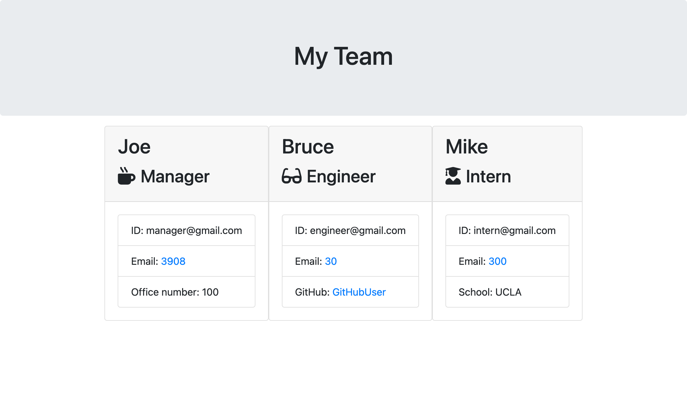

# Template-Engine--

## Table of Contents

-[Description](#Description)

-[TechnologiesUsed](#TechnologiesUsed)

-[Images](#Images)

-[Links](#Links)

# Description

The Template Engine is a command line application that generates an HTML file. It creates an HTML page with the users input. It is made for a software engineer team and asks information about the manager, engineer and intern. You may add as many team members as needed. 

# Technoglogies Used

1. NPM Inquirer
2. Jest
3. Javascript
   

# Images

# Links

Github Repository
 https://github.com/vdecyatnik/Template-Engine--

Video of working Application https://drive.google.com/file/d/1y8BJGl0QMtXM-226v7MUYBsiPkmkdWce/view